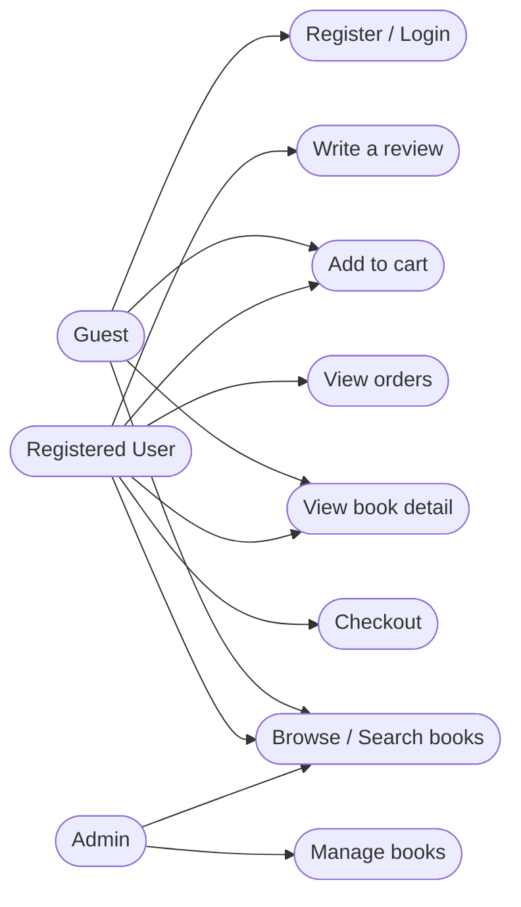
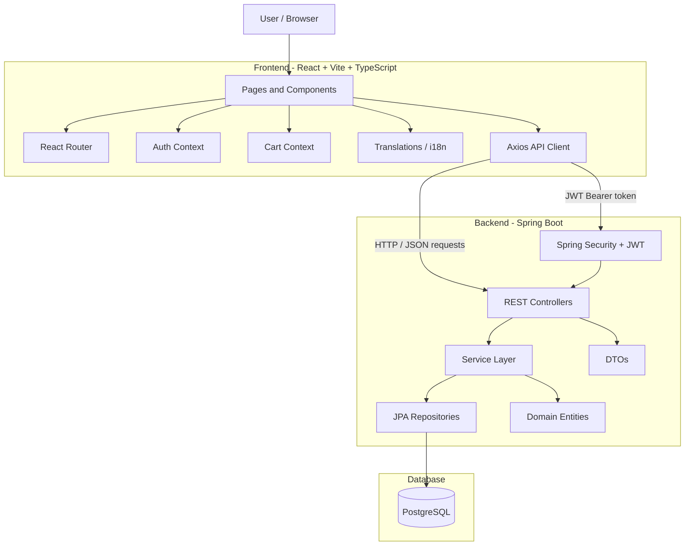
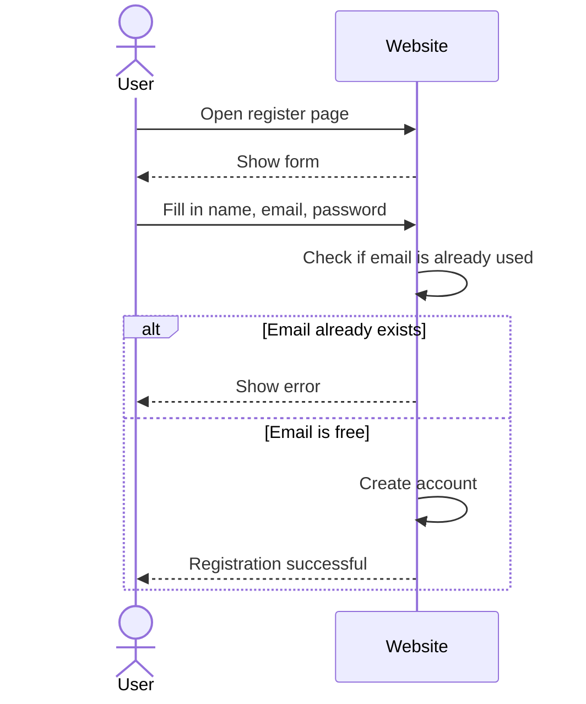
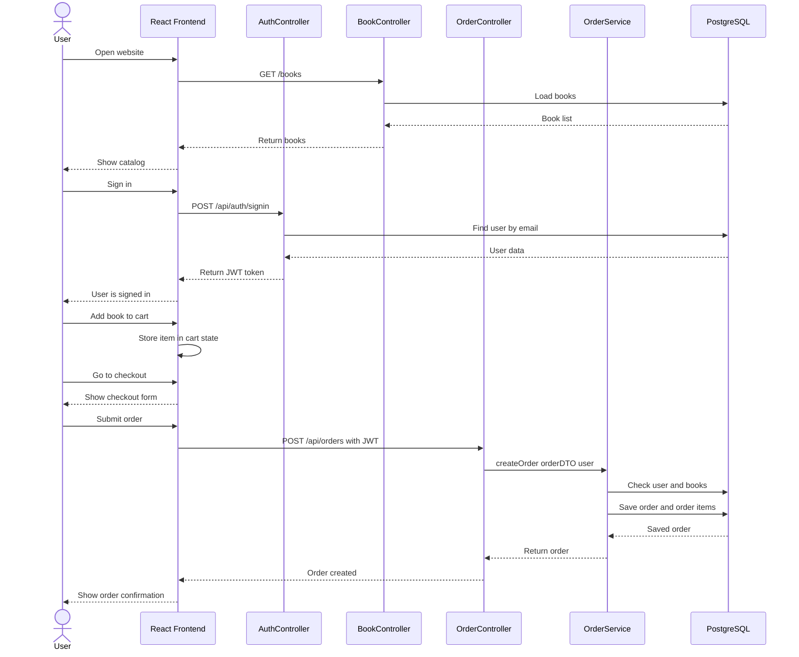
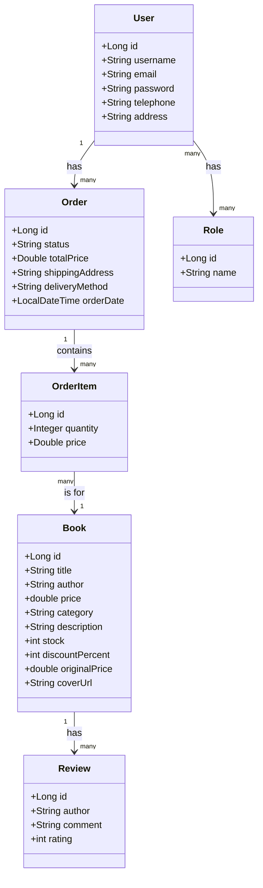
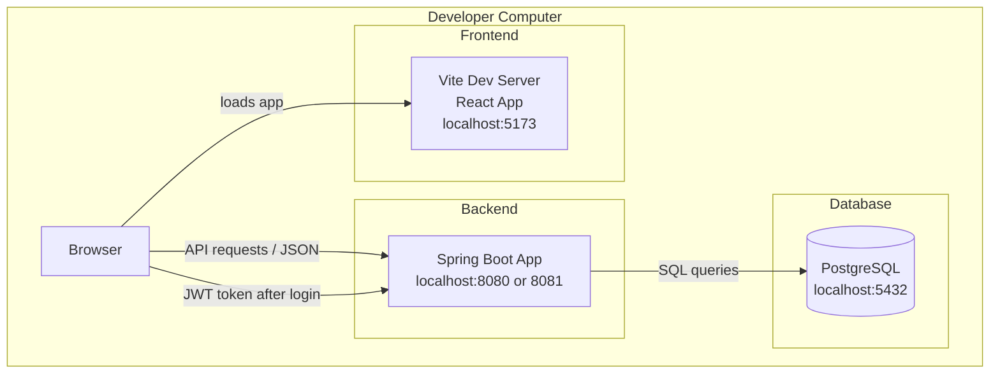

# Dokumentace projektu „Knihkupectví“

**Název projektu:** Online knihkupectví  
**Předmět:** SWI1  
**Rok:** 2026

## O čem je tento projekt

Jedná se o online knihkupectví, kde si uživatelé mohou prohlížet knihy, přidávat je do košíku a nakupovat je. Aplikace má frontend vytvořený v Reactu a backend v Javě Spring Boot. Data jsou uložena v databázi PostgreSQL.

## Použité technologie
**Frontend**
- React 18 s TypeScriptem
- Vite (pro spouštění a sestavování aplikace)
- React Router (pro navigaci mezi stránkami)
**Backend**
- Java se Spring Bootem
- Spring Security s JWT pro přihlášení
- Spring Data JPA pro přístup k databázi
**Databáze**
- PostgreSQL

## Jak spustit projekt
1. Spusťte PostgreSQL a ujistěte se, že existuje databáze s názvem `postgres`
2. Spusťte backend Spring Boot (spouští se na portu 8080)
3. Spusťte frontend pomocí `npm run dev` (spouští se na portu 5173)
4. Otevřete v prohlížeči `http://localhost:5173`

## Co aplikace umí

**Host (není přihlášen)**
- Procházet všechny knihy
- Vyhledávat knihy podle názvu nebo autora
- Filtrovat knihy podle kategorie
- Zobrazit stránku s podrobnostmi o knize včetně popisu a recenzí
- Zaregistrovat nový účet
- Přihlásit se

**Registrovaný uživatel**
- Vše, co může dělat host
- Přidat knihy do košíku
- Zadat objednávku (zadat adresu, vybrat způsob doručení)
- Zobrazit historii objednávek
- Napsat recenzi na knihu
- Upravit profil (jméno, telefon, adresa)

**Správce**
- Přidávat nové knihy
- Upravovat existující knihy
- Mazat knihy

## Struktura projektu

Backend je rozdělen do několika balíčků:

- `config` - spouští se při startu aplikace, naplní databázi výchozími daty
- `domain` – hlavní datové třídy jako Book, User, Order, Review
- `repository` – slouží ke čtení a zápisu dat do databáze
- `service` – obchodní logika (vytváření objednávek, získávání knih atd.)
- `security` – zpracovává přihlášení, JWT tokeny a řízení přístupu
- `web` – řadiče REST API, které volá frontend

Frontend je strukturován kolem stránek (HomePage, CatalogPage, CartPage, CheckoutPage, ProfilePage) a dvou globálních kontextů – jednoho pro přihlášeného uživatele a druhého pro košík.

## Databáze

Databáze obsahuje tyto hlavní tabulky:

| Tabulka | Co obsahuje |
|-------|---------------|
| users | registrovaní uživatelé |
| roles | role uživatelů (ROLE_USER, ROLE_ADMIN) |
| book | všechny knihy v obchodě |
| orders | objednávky zadané uživateli |
| order_items | jednotlivé knihy v rámci objednávky |
| review | recenze knih napsané uživateli |

## Zabezpečení

Přihlášení funguje pomocí JWT tokenů. Když se uživatel přihlásí, obdrží od serveru token. Frontend tento token uloží do localStorage a odesílá jej s každým požadavkem v hlavičce `Authorization`. Backend kontroluje token při každém požadavku a pokud není platný, je požadavek odmítnut s chybou 401.

Hesla nejsou nikdy ukládána jako prostý text, jsou hašována pomocí BCrypt.

# SWOT ANALÝZA

## Silné stránky

- Aplikace využívá moderní technologie, jako jsou React a Spring Boot, které jsou populární a dobře zdokumentované.
- Uživatelé se mohou registrovat a přihlašovat.
- Knihy jsou rozděleny do kategorií, takže je snazší najít to, co hledáte.
- Aplikace obsahuje stránku se slevami, což je pro zákazníky výhodné.
- Aplikace obsahuje základní funkce internetového knihkupectví, například katalog knih, detail knihy, košík, objednávky, slevy a recenze.
- Backend má přehlednou strukturu rozdělenou na controllery, services, repositories, DTO a domain modely.
- Projekt obsahuje vícejazyčnou podporu pomocí překladového souboru.

## Slabé stránky

- Neexistuje skutečný platební systém, uživatel může dokončit objednávku, ale nedochází k žádnému zpracování peněz.
- Aplikace byla testována pouze lokálně, v kódu nejsou napsány žádné testy.
- Heslo k databázi je napsáno přímo v konfiguračním souboru, což není bezpečné.
- Projekt zatím nemá dostatečné automatické testy.

## Příležitosti

- Mohlo by být přidáno skutečné platební rozhraní, jako je PayPal nebo platba kreditní kartou.
- Mohlo by být nasazeno na internet, aby jej mohli používat skuteční uživatelé.
- Mohla by být vytvořena mobilní aplikace, protože backendové API již existuje.
- Mohly by být přidány e-mailové notifikace při zadání objednávky.
- Systém doporučení na základě toho, co uživatel koupil dříve.
- Lze doplnit administrátorské rozhraní pro správu knih, objednávek, uživatelů a slev.
- Vyhledávání a filtrování knih lze dále vylepšit například stránkováním, řazením a pokročilými filtry.

## Hrozby

- Velcí konkurenti, jako je Amazon, již prodávají knihy online a mají mnohem více funkcí.
- Bezpečnostní problémy – mohlo by dojít k úniku JWT klíče.
- Pokud bude aplikaci používat mnoho uživatelů současně, může být pomalá, protože není k dispozici ukládání do mezipaměti.
- Bezpečnostní problémy mohou vzniknout kvůli špatně chráněným API endpointům, JWT tokenům nebo přihlašovacím údajům.
- Zastarání nebo nekompatibilita knihoven může v budoucnu způsobit technické problémy.

# Podnikový proces v EPC nebo BPMN

# Use Case diagram

# Diagram architektury

# Sekvenční diagramy (analytický a návrhový)

### Registrace

### Eshop

# Digram tříd

# Deployment diagram

