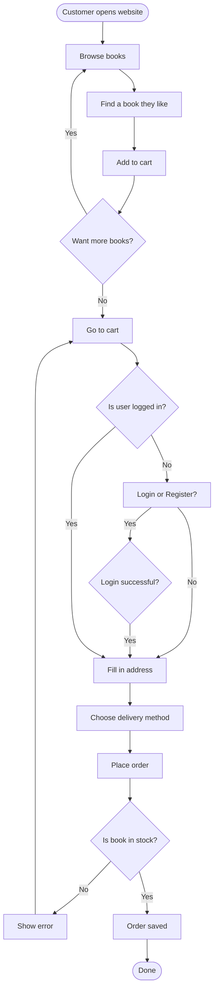
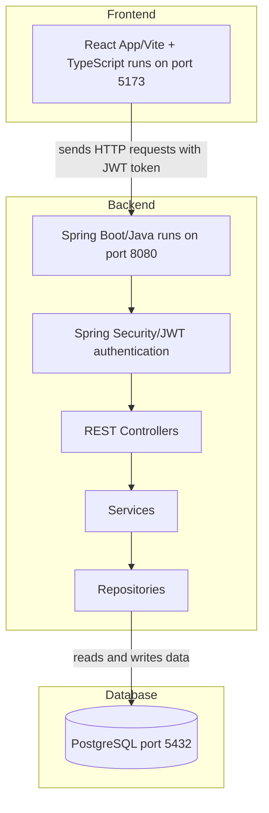
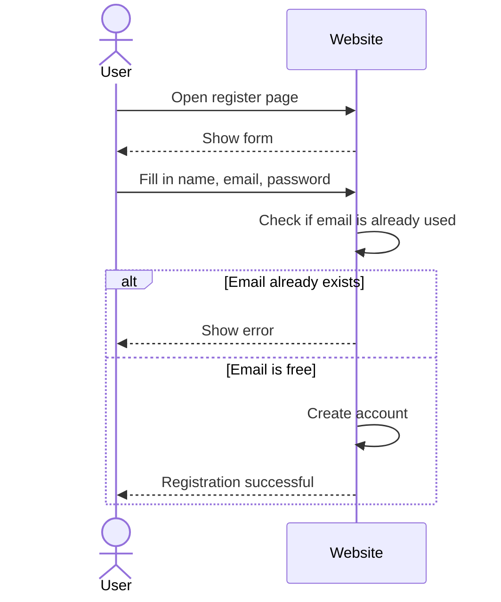
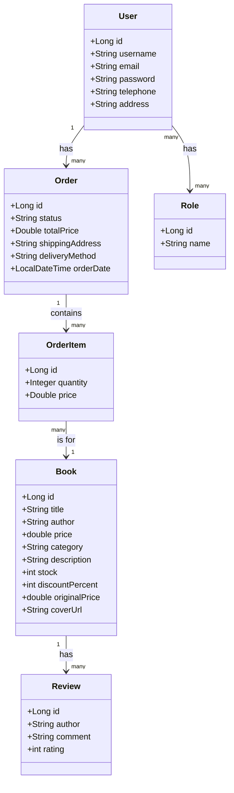
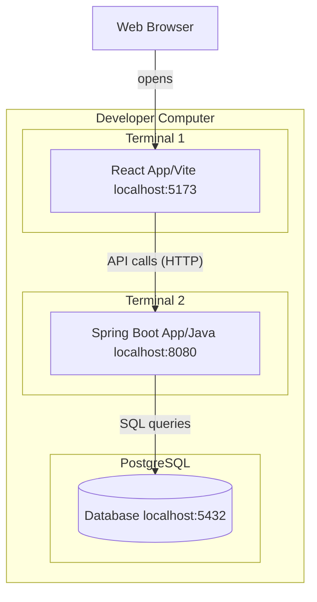

# SWOT ANALÝZA

## Silné stránky

- Aplikace využívá moderní technologie, jako jsou React a Spring Boot, které jsou populární a dobře zdokumentované
- Uživatelé se mohou registrovat a přihlašovat
- Knihy jsou rozděleny do kategorií, takže je snazší najít to, co hledáte
- Aplikace obsahuje stránku se slevami, což je pro zákazníky výhodné
- Uživatelé mohou k knihám přidávat recenze

## Slabé stránky

- Neexistuje skutečný platební systém, uživatel může dokončit objednávku, ale nedochází k žádnému zpracování peněz.
- Aplikace byla testována pouze lokálně, v kódu nejsou napsány žádné testy.
- Heslo k databázi je napsáno přímo v konfiguračním souboru, což není bezpečné.
- 
## Příležitosti

- Mohlo by být přidáno skutečné platební rozhraní, jako je PayPal nebo platba kreditní kartou
- Mohlo by být nasazeno na internet, aby jej mohli používat skuteční uživatelé
- Mohla by být vytvořena mobilní aplikace, protože backendové API již existuje
- Mohly by být přidány e-mailové notifikace při zadání objednávky
- Systém doporučení na základě toho, co uživatel koupil dříve

## Hrozby

- Velcí konkurenti, jako je Amazon, již prodávají knihy online a mají mnohem více funkcí
- Bezpečnostní problémy – mohlo by dojít k úniku JWT klíče
- Pokud bude aplikaci používat mnoho uživatelů současně, může být pomalá, protože není k dispozici ukládání do mezipaměti

# Podnikový proces v EPC nebo BPMN

# Use Case diagram

# Use Case Diagram

# Diagram architektury

# Sekvenční diagramy (analytický a návrhový)

### Registrace

# Digram tříd

# Deployment diagram

